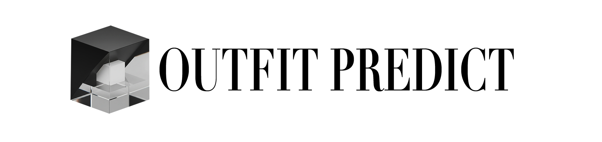

# Outfit Predict

**Outfit Predict** is a web platform designed to help you create the perfect outfit from your own wardrobe. Upload images of your clothes, and our AI-powered system will find and suggest stylish outfits you can wear.

**[➡️ Visit the deployed project: outfitpredict.ru](https://outfitpredict.ru)**

---

## 📋 Table of Contents

- [✨ Features](#-features)
- [🛠️ Tech Stack](#️-tech-stack)
- [📂 Project Structure](#-project-structure)
- [🚀 Getting Started](#-getting-started)
  - [Prerequisites](#prerequisites)
  - [Cloning the Repository](#cloning-the-repository)
  - [Environment Configuration](#environment-configuration)
  - [Running the Application](#running-the-application)
- [🧑‍💻 Development](#-development)
- [⚙️ Backend](#️-backend)
- [🚢 Deployment (CI/CD)](#-deployment-cicd)
- [🔒 SSL Setup](#-ssl-setup)
- [👥 Team](#-team)
- [📜 License](#-license)

---

## ✨ Features

- **Wardrobe Management**: Upload, view, and manage your clothing items.
- **AI-Powered Outfit Suggestions**: Get outfit recommendations based on the clothes you own.
- **Similarity Search**: Our system uses advanced similarity search to match your clothes with items in pre-styled outfits.
- **Save Favorite Outfits**: Keep track of the outfits you love.

---

## 🛠️ Tech Stack

| Category      | Technologies                                                                                              |
|---------------|-----------------------------------------------------------------------------------------------------------|
| **Frontend**  | [Next.js](https://nextjs.org/), [React](https://reactjs.org/), [TypeScript](https://www.typescriptlang.org/), [Tailwind CSS](https://tailwindcss.com/) |
| **Backend**   | [FastAPI](https://fastapi.tiangolo.com/), [Python](https://www.python.org/)                                |
| **ML/AI**     | [PyTorch](https://pytorch.org/), [YOLO](https://github.com/ultralytics/yolov5), [CLIP](https://github.com/openai/CLIP) |
| **Databases** | [PostgreSQL](https://www.postgresql.org/), [Qdrant](https://qdrant.tech/) (Vector DB), [MinIO](https://min.io/) (Object Storage) |
| **DevOps**    | [Docker](https://www.docker.com/), [Docker Compose](https://docs.docker.com/compose/), [GitHub Actions](https://github.com/features/actions), [Nginx](https://www.nginx.com/) |
| **Tooling**   | `pre-commit`, `commitizen` for code quality and standardized commits.                                     |

---

## 📂 Project Structure

Here is a high-level overview of the project's structure:

```
.
├── backend/            # FastAPI application, ML models, and business logic
├── frontend/           # Next.js frontend application
├── devops/             # Deployment scripts and CI/CD configuration
├── ssl-setup/          # SSL certificate setup scripts
├── datasets/           # Information about fashion datasets
├── notebooks/          # Jupyter notebooks for experiments
├── docker-compose.yml  # Main Docker Compose file for running the app
└── README.md           # You are here!
```

---

## 🚀 Getting Started

Follow these steps to get the project running locally.

### Prerequisites

- [**Git LFS**](https://git-lfs.github.com/): This project uses Git LFS to manage large model files.
- [**Docker**](https://www.docker.com/products/docker-desktop/) and **Docker Compose**: For running the application in containers.

### Cloning the Repository

**Important**: You must use `git lfs clone` to download the large model files correctly.

```bash
git lfs clone https://github.com/IU-Capstone-Project-2025/Outfit_predict.git
cd Outfit_predict
```

If you already cloned the repository without LFS, run `git lfs pull` inside the repository.

### Environment Configuration

1.  **Create an environment file** by copying the example:
    ```bash
    cp .env.example .env
    ```

2.  **Update the `.env` file** with your configuration values. You will need to register at [Qdrant](https://qdrant.tech/) to get an API key.

### Running the Application

Once your `.env` file is configured, you can start the application using Docker Compose:

```bash
docker-compose up --build -d
```

The application will be available at the following URLs:

- **Frontend**: [http://localhost:3000](http://localhost:3000)
- **Backend API**: [http://localhost:8000](http://localhost:8000)
- **API Docs**: [http://localhost:8000/docs](http://localhost:8000/docs)
- **MinIO Console**: [http://localhost:9001](http://localhost:9001)

To stop the application, run `docker-compose down`.

---

## 🧑‍💻 Development

We use `pre-commit` hooks to ensure code quality and `commitizen` for standardized commit messages. Please see our **[Development Guide (dev.md)](dev.md)** for detailed setup instructions.

---

## ⚙️ Backend

The backend is a FastAPI application that serves the API and runs the machine learning models. For more details on the architecture, API endpoints, and how to run backend tests, see the **[Backend README (backend/README.md)](backend/README.md)**.

---

## 🚢 Deployment (CI/CD)

This project is configured for Continuous Integration (CI) and Continuous Deployment (CD) using GitHub Actions. We have detailed guides for setting up the deployment environment.

- **[Deployment Guide (devops/DEPLOYMENT_GUIDE.md)](devops/DEPLOYMENT_GUIDE.md)**
- **[Deployment Setup (devops/DEPLOYMENT_SETUP.md)](devops/DEPLOYMENT_SETUP.md)**

---

## 🔒 SSL Setup

For production, we use Nginx as a reverse proxy and Let's Encrypt for SSL certificates. The setup is automated with scripts.

- **[SSL Setup Guide (ssl-setup/README.md)](ssl-setup/README.md)**

---

## 👥 Team

| Name                | Role                                 |
|---------------------|--------------------------------------|
| **Bulat Sharipov**  | Team Lead, ML Engineer, Backend Dev  |
| **Victor Mazanov**  | Project Manager, Customer Development |
| **Dinar Yakupov**   | Frontend Developer                   |
| **Danil Fathutdinov**| ML Engineer, Backend Developer       |
| **Artyom Grishin**  | Product Designer                     |
| **Remal Gareev**    | Backend Developer, DevOps Engineer   |

---

## 📜 License

This project is licensed under the MIT License. See the [LICENSE](LICENSE) file for details.
