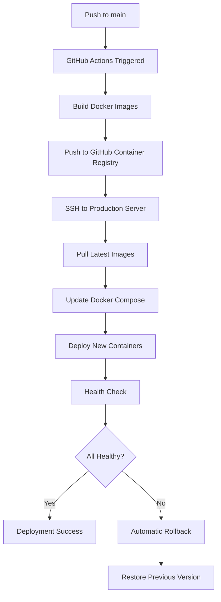

# DevOps & Deployment

This directory contains all the necessary files and documentation for deploying the Outfit Predict application using Continuous Deployment (CD) with GitHub Actions.

## 📁 Files Overview

- **`DEPLOYMENT_SETUP.md`** - Complete setup guide for CD pipeline
- **`deploy.sh`** - Production deployment script with rollback capabilities
- **`setup-nginx.sh`** - Nginx configuration script for reverse proxy
- **`env.production.template`** - Environment variables template for production
- **`docker-compose.prod.yml`** - Optimized production Docker Compose configuration

## 🚀 Quick Start

### 1. One-Time Setup

```bash
# 1. Configure GitHub Secrets (see DEPLOYMENT_SETUP.md for details)
# Required secrets:
# - DEPLOY_HOST (your server IP/domain)
# - DEPLOY_USER (SSH username)
# - DEPLOY_SSH_KEY (SSH private key)
# - NEXT_PUBLIC_API_URL (frontend API URL)

# 2. Set up your server
ssh user@your-server.com
git lfs clone https://github.com/IU-Capstone-Project-2025/Outfit_predict.git
cd Outfit_predict

# 3. Configure environment
cp devops/env.production.template .env
nano .env  # Fill in your actual values

# 4. Make deployment script executable
chmod +x devops/deploy.sh

# 5. Run initial deployment
./devops/deploy.sh deploy
```

### 2. Automatic Deployment

Once configured, deployment happens automatically:

- **Push to `main` branch** → Triggers automatic deployment
- **Manual trigger** → Go to Actions tab in GitHub and run "CD - Deploy to Production"

## 🔄 CD Pipeline Flow



## 🛠️ Manual Operations

### Deploy Latest Version
```bash
ssh user@your-server.com
cd Outfit_predict
./devops/deploy.sh deploy
```

### Check Service Health
```bash
./devops/deploy.sh health
```

### Rollback to Previous Version
```bash
./devops/deploy.sh rollback
```

### View Deployment Logs
```bash
tail -f /var/log/outfit-deploy.log
```

### Check Running Services
```bash
docker-compose -f docker-compose.prod.yml ps
docker-compose -f docker-compose.prod.yml logs -f
```

## 🔧 Configuration Files

### GitHub Actions Workflow
- **Location:** `.github/workflows/cd.yml`
- **Purpose:** Automates the entire deployment process
- **Features:**
  - Multi-platform Docker builds with cache optimization
  - Automatic image tagging and versioning
  - SSH-based deployment with health checks
  - Slack notifications (optional)

### Deployment Script
- **Location:** `devops/deploy.sh`
- **Purpose:** Robust server-side deployment with backup/rollback
- **Features:**
  - Automatic backup before deployment
  - Health checks with automatic rollback on failure
  - Colored output and comprehensive logging
  - Support for manual operations

### Production Docker Compose
- **Location:** `docker-compose.prod.yml`
- **Purpose:** Optimized container configuration for production
- **Features:**
  - Pre-built images from GitHub Container Registry
  - Health checks for all services
  - Resource limits and reservations
  - Dependency management with proper startup order

## 📊 Monitoring

### Health Endpoints
- **Frontend:** `http://localhost:3000/`
- **Backend:** `http://localhost:8000/health`
- **Backend API Docs:** `http://localhost:8000/docs`
- **MinIO Console:** `http://localhost:9001/`

### Log Files
- **Deployment:** `/var/log/outfit-deploy.log`
- **Application:** `./logs/` (mounted volume)
- **Container Logs:** `docker-compose logs <service>`

### Service Status
```bash
# Check all services
docker-compose -f docker-compose.prod.yml ps

# Check specific service
docker-compose -f docker-compose.prod.yml ps backend

# View service logs
docker-compose -f docker-compose.prod.yml logs -f backend
```

## 🔐 Security Best Practices

1. **Environment Variables:** All sensitive data stored in `.env` file, never committed
2. **SSH Access:** Uses dedicated SSH key for deployment, stored in GitHub Secrets
3. **Container Registry:** Images stored in GitHub Container Registry with access controls
4. **Resource Limits:** All containers have memory/CPU limits to prevent resource exhaustion
5. **Health Checks:** Automatic health monitoring with rollback on failure

## 🐛 Troubleshooting

### Common Issues

1. **Deployment Fails**
   ```bash
   # Check deployment logs
   tail -f /var/log/outfit-deploy.log

   # Check GitHub Actions logs
   # Go to repository → Actions → Latest workflow run
   ```

2. **Services Not Starting**
   ```bash
   # Check container status
   docker-compose -f docker-compose.prod.yml ps

   # Check service logs
   docker-compose -f docker-compose.prod.yml logs <service>

   # Check system resources
   free -h && df -h
   ```

3. **SSH Connection Issues**
   ```bash
   # Test SSH connection
   ssh -i ~/.ssh/your-key user@server

   # Check SSH key in GitHub Secrets
   # Verify public key is in server's ~/.ssh/authorized_keys
   ```

### Emergency Procedures

1. **Immediate Rollback**
   ```bash
   ssh user@server
   cd Outfit_predict
   ./devops/deploy.sh rollback
   ```

2. **Manual Container Restart**
   ```bash
   docker-compose -f docker-compose.prod.yml restart
   ```

3. **Complete Reset**
   ```bash
   docker-compose -f docker-compose.prod.yml down
   docker-compose -f docker-compose.prod.yml up -d
   ```

## 📞 Support

- **Deployment Issues:** Check `DEPLOYMENT_SETUP.md` for detailed troubleshooting
- **GitHub Actions:** Review workflow logs in the Actions tab
- **Server Issues:** SSH into server and check logs in `/var/log/outfit-deploy.log`
