# DevOps & Deployment

This directory contains deployment files and scripts for the Outfit Predict application using a self-hosted GitHub Actions runner.

##  Files Overview

- **`setup-self-hosted-runner.sh`** - Self-hosted GitHub Actions runner installation script
- **`initial-deploy.sh`** - Manual deployment script (fallback)
- **`env.production.template`** - Environment variables template for production
- **`setup-nginx.sh`** - Nginx configuration script for reverse proxy

##  Quick Start

** Follow the complete setup guide:** [`DEPLOYMENT_GUIDE.md`](../DEPLOYMENT_GUIDE.md)

### Summary of Steps:

1. **Setup Environment**
   ```bash
   chmod +x devops/setup-self-hosted-runner.sh devops/initial-deploy.sh
   cp devops/env.production.template .env
   nano .env  # Configure your values
   ```

2. **Install Runner**
   ```bash
   sudo ./devops/setup-self-hosted-runner.sh
   ```

3. **Configure & Start**
   ```bash
   # Get token from GitHub Settings → Actions → Runners
   sudo -u github-runner /home/github-runner/configure-runner.sh \
     https://github.com/IU-Capstone-Project-2025/Outfit_predict YOUR_TOKEN

   sudo systemctl start github-actions-runner
   sudo systemctl enable github-actions-runner
   ```

4. **Deploy**
   ```bash
   git push origin main  # Automatic deployment!
   ```

## 🔄 How It Works

```mermaid
graph TD
    A[Push to main] --> B[Self-hosted Runner on Server]
    B --> C[Checkout Code Locally]
    C --> D[Build Docker Images]
    D --> E[Deploy with docker-compose]
    E --> F[Health Checks]
    F --> G[Success! 🎉]
```



**Benefits:**
-  **Fast**: ~3-5 minutes deployment
-  **Local**: No Docker registry needed
-  **Automatic**: Push to deploy
-  **Secure**: Isolated runner user
-  **Resource efficient**: Uses your server directly

## Management Commands

### Runner Control
```bash
sudo systemctl status github-actions-runner    # Check status
sudo systemctl restart github-actions-runner   # Restart
sudo journalctl -u github-actions-runner -f    # View logs
```

### Application Control
```bash
docker-compose ps                    # Check containers
docker-compose logs -f              # View logs
docker-compose restart backend      # Restart service
./devops/initial-deploy.sh           # Manual deployment
```

##  Monitoring

- **Runner Status**: GitHub → Settings → Actions → Runners
- **Deployment Logs**: `sudo journalctl -u github-actions-runner -f`
- **Application**:
  - Frontend: http://localhost:3000
  - Backend: http://localhost:8000
  - API Docs: http://localhost:8000/docs
  - MinIO: http://localhost:9001

##  Common Issues & Fixes

### Runner Offline
```bash
sudo systemctl restart github-actions-runner
sudo usermod -aG docker github-runner
```

### Deployment Fails
```bash
./devops/initial-deploy.sh  # Manual fallback
docker-compose ps           # Check containers
docker-compose logs         # Check logs
```

### Permission Errors
```bash
sudo chown -R github-runner:github-runner /home/github-runner/
sudo systemctl restart github-actions-runner
```

##  Need Help?

-  **Complete Guide**: [`DEPLOYMENT_GUIDE.md`](../DEPLOYMENT_GUIDE.md)
-  **Debug**: `sudo journalctl -u github-actions-runner -f`
-  **Manual Deploy**: `./devops/initial-deploy.sh`

---

** Result**: Push any change to `main` → Automatic deployment in ~3-5 minutes! 🚀
